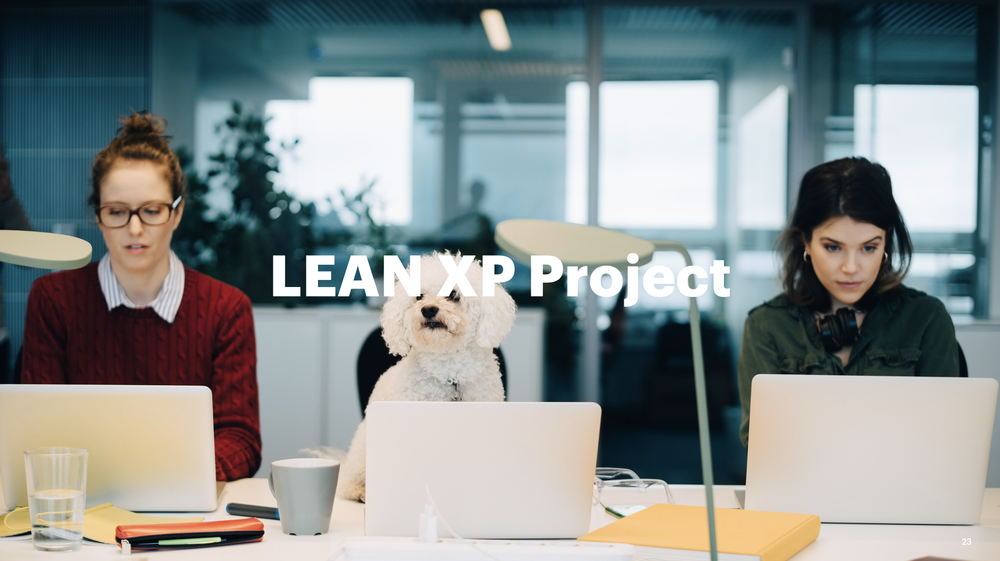

# LEAN XP

## Objective of the presentation
To understand the benefits of adopting agile methodologies, with a focus on Lean XP. We will explore how these practices not only address current software development challenges but also foster a culture of continuous improvement and collaboration that drives team success and customer satisfaction.

## Topics:
- What is Lean?
- Lean Principles
- What is XP?
- Practices
- Values
- Pair Programming
- Common Errors
- Working Successfully
- Lean XP Project

## LEAN

### What is Lean?
Lean Software Development (LSD) is an agile framework focused on optimizing development time and resources, eliminating waste, and delivering only what the product needs. Lean emphasizes identifying and eliminating activities that do not add value to the end customer. Instead of rigid and bureaucratic approaches, Lean promotes flexibility, adaptability, and a focus on what truly matters to the customer. It is also known as Minimum Viable Product (MVP) strategy.

### Principles

- Waste Elimination:
  - Elimination of unnecessary code
  - Early specification
  - Manual processes
  - Delays in the development cycle
  - Defects and any other form of waste

- Continuous Delivery of Value:
  - LEAN in software development emphasizes early and frequent delivery of functional features to the customer.
  - The goal is to maximize value delivered in each iteration or development cycle, enabling rapid feedback and adaptation to changes in customer requirements.

- Process Optimization:
  - Identify and eliminate bottlenecks
  - Smooth workflow
  - Reduce wait times and continuously improve efficiency and quality at each stage of the process.

- Focus on Quality:
  - Early defect detection
  - Test automation
  - Continuous code review
  - Constant feedback to ensure quality standards are met at all times.

- Collaboration and Continuous Improvement:
  - LEAN fosters collaboration among all members of the development team, as well as external stakeholders.
  - It encourages constantly seeking ways to improve processes, tools, and practices through reflection, experimentation, and continuous learning.

## XP

### What is XP?
Extreme Programming (XP) is an agile software development methodology that focuses on delivering high-quality software quickly and adaptably. Created by Kent Beck in the late 1990s, XP focuses on principles such as communication, feedback, simplicity, and courage. Extreme Programming is based on a set of practices and values aimed at improving team productivity, software quality, and customer satisfaction.

### Practices

- Pair Programming:
  - Two programmers work together on the same team, sharing a workstation and collaborating on code writing.

- Continuous Unit Testing (Continuous Integration):
  - Unit tests are written before writing the code and run automatically on a continuous basis to ensure software quality.

- Continuous Integration:
  - Code changes are automatically integrated into a shared repository multiple times a day, helping to identify and resolve integration issues quickly.

- Refactoring:
  - It is performed frequently and systematically to improve the structure and design of the code without changing its functionality.

- Planning Game:
  - It is conducted in short iterations (usually one or two weeks) to identify and prioritize product features and plan team activities.

- Simple Design:
  - It focuses on creating the simplest solution that meets current requirements, avoiding over-engineering and anticipating future changes.

### Values

- "What matters most in team software development is communication." (Kent Beck)
  - It promotes open and effective communication among all members of the development team, as well as with external stakeholders.

- Simplicity:
  - Simplicity in Lean XP means focusing on what is necessary to deliver value efficiently.
  - "Simplicity is the most intensely intellectual value of XP."
  - "What is the simplest thing that could work?"

- Feedback:
  - "The sooner you know it, the sooner you can adapt."
  - "Feedback is a fundamental part of communication."
  - "Feedback also contributes to simplicity."
  - Feedback in Lean XP involves continuously seeking and providing constructive criticism to improve the product, processes, and personal development.

- Courage:
  - "Courage is effective action in the face of fear."
  - "Sometimes courage manifests as a willingness to act."
  - "The courage to speak the truth, pleasant or unpleasant, fosters communication and trust."
  - The value in Lean XP involves taking risks, trying new things, discussing issues, and making tough decisions even in uncertain conditions.

- Respect:
  - "The four values above point to one that is beneath the other four: respect."
  - "Every person whose life is affected by software development has the same value as a human being."
  - It recognizes and values the contributions of each team member, fostering a collaborative and respectful work environment.

## Pair Programming?

### Improving code quality
- Review and discuss each line of code in real-time.
- Early detection of errors
- Identification of more efficient solutions
- Adoption of best practices

### Learning and professional development
- Knowledge transfer
- Sharing approaches, techniques, and skills
- Continuous learning environment

### Error reduction
- Two pairs of eyes are better than one.
- Reduce the chances of overlooking errors or defects.
- More robust and reliable software

### Increased focus and concentration
- Concentration and focus on the assigned task
- Commitment
- Motivation

### Improving collaboration and communication
- Active collaboration
- Effective communication
- Strengthens mutual understanding

### Common errors in Pair Programming
- Lack of defined roles
- Excessive dependence
- Lack of follow-up
- Ineffective communication
- Lack of preparation
- Not respecting time limits
- Lack of role rotation
- Resistance to feedback

### Working successfully
- Effective communication
- Establish clear roles
- Follow XP practices
- Active collaboration
- Take regular breaks
- Provide and receive feedback
- Follow XP practices
- Practice empathy
- Maintain a positive environment

## Roles in LEAN XP

| Number | Role                   | Description                                                                                       |
|--------|------------------------|---------------------------------------------------------------------------------------------------|
| 1      | Product Owner          | Represents the customer or business. Responsible for defining and prioritizing product requirements. |
| 2      | Scrum Master           | Facilitates the agile process. Removes obstacles faced by the team.                                |
| 3      | Developer              | Responsible for writing code, conducting tests, and delivering functional software increments during each sprint. |
| 4      | Tester                 | Responsible for testing the software to ensure it meets requirements and functions correctly.     |
| 5      | Stakeholders Team      | End users and other stakeholders in the project.                                                   |
| 6      | Coach (XP Coach)       | External or internal facilitator who guides the team in adopting and practicing XP principles and practices. |
| 7      | Tracker                | Responsible for keeping the task board or work tracking system updated.                            |
| 8      | Consultant             | Experts in specific areas that may not be covered by the core team.                                |

## Daily and Weekly Cycle in a Lean XP Project

| Activity                                        |
|-------------------------------------------------|
| **Daily Stand-Up**                              |
| - Each morning, the team discusses their main activities for the day.                                  |
| - They mention what they achieved yesterday, identify what they will do today, and highlight anything blocking progress. |
| - This fast-paced meeting lasts less than a minute per person.                                          |
| **IPM (Iteration or Increment Planning Meeting)**|
| - The PM guides the SE team through user stories that will be part of the prioritized backlog.        |
| - The PM writes and prioritizes stories for the next IPM using evidence from user research, tests, and analytics data. |
| **Weekly Work Cycle**                           |
| - Weekly work cycle.                            |
| - SEs pull estimated user stories from the prioritized backlog as soon as current stories are completed. |
| - The SE team estimates user stories based on complexity.                                               |
| - Then, the team reviews user stories before marking them as completed.                                 |
| **Retrospective**                               |
| - The team meets to reflect.                    |
| - The goal is to continuously improve the agile process, identify issues, and list improvement actions for the following week. |
| - Large stories may be split or redefined.     |
| - PD builds and tests prototypes to meet user needs and reduce the risk of non-value-added features.  |
| - The team asks questions to clarify the feasibility of the story.                                     |
| - There should be only one User Story per pair of SEs.                                                  |
| - Teams are co-located to enable pair programming.                                                      |
| - Stakeholders are not present during this meeting.                                                     |

